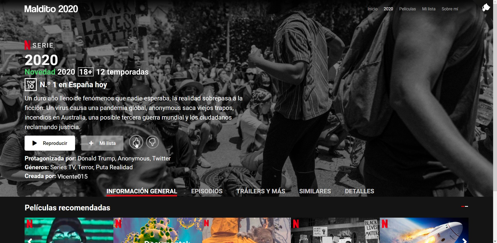

### Sitio web inspirado en Netflix sobre la serie 2020, con una lista de episodios que no se pueden reproducir, solo por las risas.

> [maldito2020.com](https://maldito2020.com)

# Seguimiento del desarrollo
He creado un [hilo en twitter](https://twitter.com/imvicente015/status/1271421688572456960?s=20) donde podéis ver el desarrollo que hago en este proyecto cada día.

# Primeros diseños y prototipos

# Contribuir
No tengo mucha idea de como funciona GitHub, así que si queréis colaborar contactad conmigo por Discord: ``Vicente#0001``
