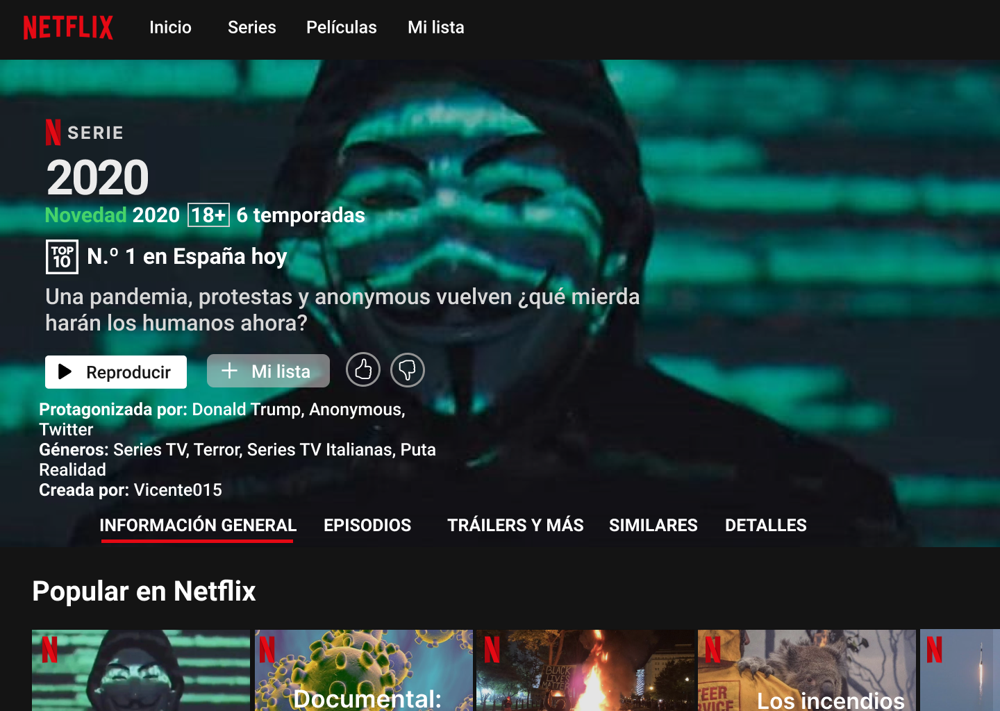
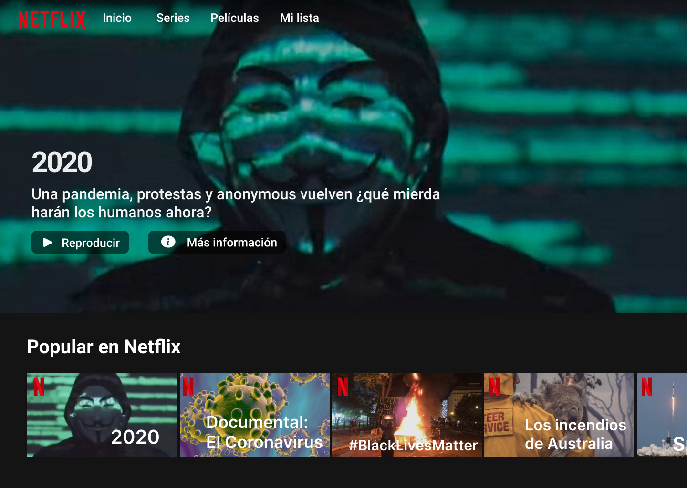
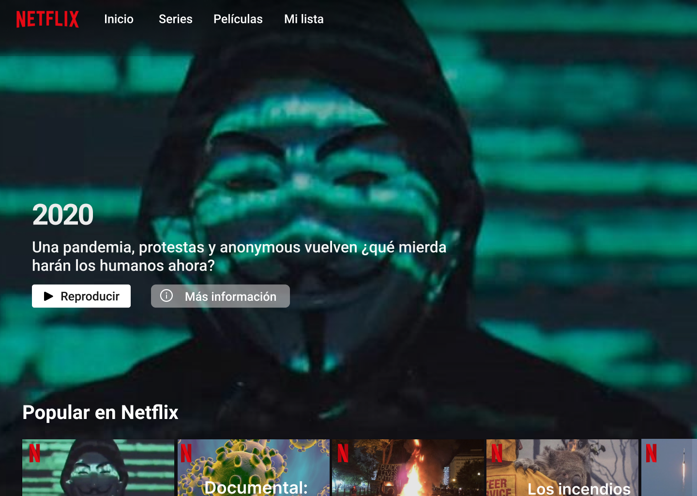

### Sitio web inspirado en Netflix que muestra una serie falsa llamada "2020" en forma de comedia donde se muestran los episodios de lo que ha ocurrido este año.

## Diseños

## Contribuir
No tengo mucha idea de como funciona GitHub, así que si queréis colaborar contactad conmigo por Discord: ``Vicente#0001``
